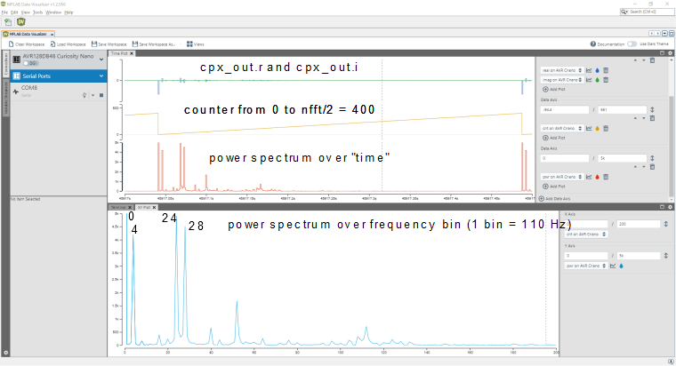

# Measuring FFT Performance on an AVR® Microcontroller
## Abstract
In this document we're demonstrating the ability of an AVR MCU to run a third-party FFT library (kissFFT) and quantify its performance. 

## Intro
The Fast Fourier Transformation (FFT) is a versatile tool for signal analysis. The general idea, in terms of electronic signals, is to de-compose a given signal (in the time domain) into sinus-shaped components (in the frequency domain). Each component has a frequency, a phase, and an amplitude. 
By observing the parameters of the components, FFT can serve as a filtering tool, and isolate a periodic signal in noisy environment, detect frequency shifts of a signal, or simply distinguish amplitudes in high and low frequency bands for controlling your disco lights.

## FFT Library
FFT libraries can focus on different main criteria. We chose kissFFT, which focuses on simplicity and compactness. It is easy to integrate into an AVR project, implemented in C, and has a useful licensing model. On the other hand, there are no windowing functions (aside from the implicit rectangular window when picking data blocks out of a stream), and there are hardly any features such as peak localization - this is fully up to the application.
You may prefer different criteria for your library, or even implement your own FFT functions, but the general upshots from this document are also valid there.

## Example
In this section, we examine the implementation and the example code we have created.
The code shows how to run FFT and measure the speed of execution. For simplicity, we use a hard-coded input signal for the FFT algorithm:
```
const int16_t sinewave[1024] = { ... };
```
The signal is the same periodic signal as used in the Infinite Impulse Response (IIR) Filters section. It has these properties:
- Sine wave with fundamental frequency f<sub>0</sub> = 440 Hz
- Sampling rate f<sub>S</sub> = 44.1 kHz
- DC offset
- Strong harmonic overtones (”fuzz” effect, deliberately added)

The `nfft` parameter selects the sample length in kissFFT, i.e., how many data points are used for the FFT operation. It also determines the number of frequency bins (`nfft / 2`) in the operation’s output and hence, the width of each
bin (f<sub>S</sub>/`nfft`). Consequently, `nfft` affects the speed of the filter.
In the example, we select:
```
int nfft = 800;
```
and therefore:
- Number of bins `nfft` / 2 = 400
- Bin width = 2f<sub>S</sub> / `nfft` ≈ 110 Hz

The resulting bin width will work well with the known fundamental frequency of 440 Hz of the example - but for speed optimization, use values for `nfft` that are powers of two (e.g., 64 or 256).
For real signals in the time domain (just like a sequence of ADC conversions provides), the kissFFT library recommends this function:
```
kiss_fftr(cfg, cpx_in , cpx_out); // The actual FFT operation
```
where `cfg = kiss_fftr_alloc(nfft, 0, 0, 0);` is a required set of configuration parameters, `cpx_in` is the input data (real) and `cpx_out` is the complex output data.
Note: The kissFFT library provides other functions that may have complex input. For this reason, the input variable name has the prefix `cpx_`. Nonetheless, the input signal is a sequence of ADC sampling values and hence, comprises only real numbers.

Now the application can proceed and evaluate specific information in `cpx_out[n]` for its purposes. In our case, we calculate the power spectrum `pwr`, send it to the PC using the USART peripheral, and plot it on the PC using the Data Visualizer.

First, calculate `pwr`:
```
//Calculating the power spectrum
pwr = sqrt(cpx_out[n].r * cpx_out[n].r + cpx_out[n].i * cpx_out[n].i);
```
For each frequency bin `n`, the absolute value of the complex result vector `cpx_out[n]` is calculated from its real and imaginary components, `cpx_out[n].r` and `cpx_out[n].i`, respectively.
When the device is connected to a PC, the MPLAB® Data Visualizer can be used for signal analysis.  
A visualization of FFT over Sine Wave with Low Amplitude  



 Refer to the [Microchip Application Note AN4515: "Processing Analog Sensor Data with Digital Filtering"](https://ww1.microchip.com/downloads/en/Appnotes/ProcessAnalogSensorDataDigitalFiltering-DS00004515.pdf) for further interpretation of the power spectrum.
 
## Performance and Properties
In comparison to other filter techniques, FFT is not easy on CPU load: depending on `nfft` (and the application’s requirements), the device’s CPU can be busy for a substantial time.
When the actual device is accessible, the duration of one FFT can be measured by observing the output level of a digital output pin with an oscilloscope or a logic analyzer. In the example, the Curiosity Nano board LED pin can be
toggled:
```
PORTD.OUTSET = PIN6_bm; // Make PD6 output logic high
kiss_fftr(cfg, cpx_in , cpx_out); // The actual FFT operation
PORTD.OUTCLR = PIN6_bm; // Make PD6 output logic low
```
The measured duration can be converted to ‘number of FFT per MHz’ to compare performance or scale it with clock frequency. This method is recommended for applications where timing and CPU load are critical.

When the device or the required tools are not accessible, you can use MPLAB X to measure the speed of the algorithm on a simulated AVR device. This approach provides a quick and easy estimation over the upper theoretical performance limit.

The following table is listing performance measured on the Curiosity Nano with a logic analyzer:

| `nfft`|Cycles per FFT|
|------:|-------------:|
|4	|5,300|
|8	|12,000|
|16	|30,100|
|32	|67,000|
|64	|161,000|
|128|348,000|
|256|810,000|
|512|1,750,000|

 
As an example, an FFT with `nfft=64` uses about 161 kilocycles per FFT, corresponding to 6.2 FFT per MHz. Consequently, a device running at a core frequency of 20 MHz could perform twenty times as many, i.e., 124 FFT per second. If the device uses an external crystal with only 32.768 kHz, the same FFT operation takes apporximately five seconds.

<b>Note:</b> The maximum `nfft` value is depending on the actual memory configuration of the device and the memory requirements of the rest of the application.
For speed optimization, use values for `nfft` that are powers of two (e.g., 64 or 256).


## Conclusion and Use Cases
We have shown that an AVR device can perform Fast Fourier Transform using a third-party library (kissFFT). The FFT can provide valuable information other digital filtering techniques can’t, but at the cost of CPU cycles: It depends on the application’s requirements and details whether the FFT can be run continuously or not. Alternatively, an FFT can only occasionally be used to optimize parameters for other, faster filters.

Another point to keep in mind is the virtual precision, as suggested by the power spectrum, vs. the actual accuracy of the measurement:
One aspect: the oscillator providing the time basecan suffer a temperature drift of several percent. This is less of a problem when there is a short time between sampling and usage of the FFT. It is relevant when interacting with external devices that have their own time base.
The other aspect is that frequency bins are often labelled with a single frequency (suggesting a high level of accuray), whereas each bin has an actual width determined by the signal's sampling rate and `nfft`.

## Sources
- Original kissFFT lib is here:
https://github.com/mborgerding/kissfft
	<br>(Note: "kiss-FFT" is a wrapper of kissFFT for Android, and gets a lot of search engine hits)
- Code example for Microchip Studio and AVR64EA48 is  here:
https://github.com/microchip-pic-avr-examples/avr64ea48-digital-filters-studio