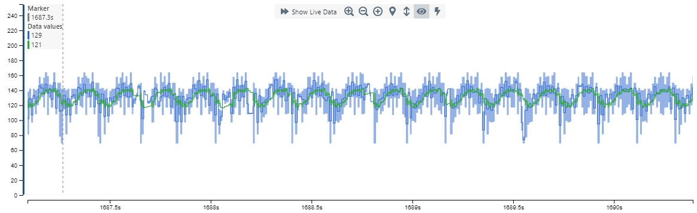
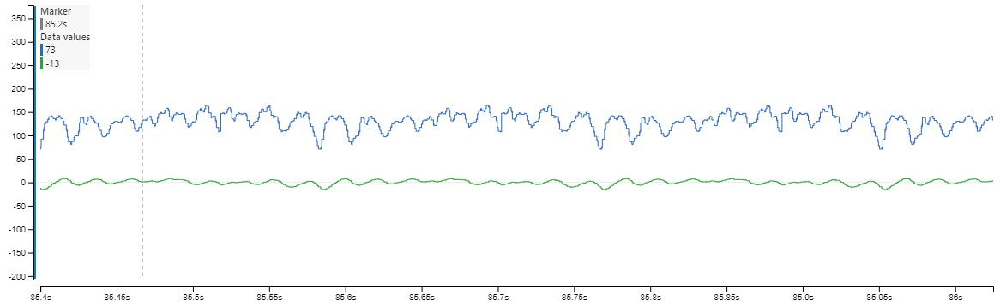

# IIR Filter

Infinite Impulse Response (IIR) filters are feedback-based filters, i.e., the previous output plays a role in the current output. Due to the feedback principle, these filters lose the phase information and might be unstable, so they are not always the first choice for audio applications. But for sensor readings, they can be a great tool. For this code example, a simple and flexible implementation of IIR was chosen, with emphasis on ease of use.
For the math behind the filter see the[Microchip Application Note AN4515: "Processing Analog Sensor Data with Digital Filtering"](https://ww1.microchip.com/downloads/en/Appnotes/ProcessAnalogSensorDataDigitalFiltering-DS00004515.pdf) and the sources listed below.


The filter offers these filters:

Filters                  | Enum                     |
-----------------------  | -----------------------  | 
Low Pass Filter          | LPF                      |
High Pass Filter         | HPF                      |
Band Pass Filter         | BPF                      |
Notch Filter             | NOTCH                    |
Peaking Band EQ Filter   | PEQ                      |
Low Shelf Filter         | LSH                      |
High Shelf Filter        | HSH                      |

Select for example the Low Pass (`LPF`) by

```c
#define FILTER_TYPE LPF
```
Note: *Only the initialization time of the filter will be affected when choosing the filter type.*


## Examples
Both Low Pass (`LPF`) and Band Pass (`BPF`) filter effects will be discussed here. In the plots, the green graph is the filtered result and the blue is the original. 

### Low Pass Filter
A low pass filter is a filter that passes the signals lower than a certain frequency threshold `freq` and attentuates / rejects the signal outside that range. Often, for filters with high/low discrimination, the term "bandwidth" denotes that frequency threshold (think of a low pass filter as a "bandpass from zero to _bandwidth_", and a high pass filter being a "band pass from _bandwidth_ to infinity"). Here, the variable `bandwidth` determines the shape of the transition between high/low areas. 
The variable `srate` helps to determine the phase (Ω) between samples.


```c
    smp_type freq = 8.0;                    // Frequency in Hertz
    smp_type srate = 255.0;                 // Samples per second
    smp_type bandwidth = 5;               // Bandwidth in octaves
```
Note that the bandwidth is configured in octaves. 
A calculator can be used to find **Quality Factor**, see the bottom of the page here:
http://www.sengpielaudio.com/calculator-cutoffFrequencies.htm
.
That **Quality Factor** can be used to calculate a bandwidth here:
http://www.sengpielaudio.com/calculator-bandwidth.htm .

For example:
```
Center Frequency = 12
Bandwidth in Hertz: Highest difference between signal 
Since this signal is a continous 12 Hz signal, it would be 12 max -12 min = 0 hz
Quality Factor -> 1
```



### Band Pass Filter

A band pass filter is a filter that rejects or attenuates signals outside of a certain frequency range and accepts it inside. 

Ideally, a band-pass filter does not attenuate or amplify signals inside the range and completely remove the signal outside the frequency range. The center frequency of the band-pass filter is determined by `bandwidth`.


```c
    smp_type freq = 3.0;                    // Frequency in Hertz
    smp_type srate = 255.0;                 // Samples per second
    smp_type bandwidth = 1;               // Bandwidth in Octaves
```




## Data Visualizer an Timing

The graphing was done using MPLAB® Data Visualizer, which can be accomplished by updating **main.c**.  A configuration for **Data Visualizer** can be found in the project called `data_visualizer.json`.

The configuration can be loaded by clicking "*Load Workspace*" at the top of the Data Visualizer and connecting to the correct COM-port.


Toggling of **PB2** is done to time the IIR filter when setting **`ONLY_SEND_USART`** to:
```c
#define ONLY_SEND_USART 0
```

Sending over USART with **115200** baud rate, is done using:
```c
#define ONLY_SEND_USART 1
```
Two values are here sent:
```
original value: uint8_t
new value: float32
```
## Performance and Properties
### Performance
The cycle time of the IIR filter is depending on the exact configuration. For `float` data type we observe 1280 cycles. Some combinations of compiler and device architecture support changing the size of `double`, e.g., from 32-bit to 64-bit. An increase improves the precision, but with a cost of a slower run-time. Integers will not work with this implementation.

Use the type definition `typedef float smp_type;` in `biquad.h` to change the data type in the filter implementation. The compiler may require additional arguments, such as `-fno-short-double`. See the compiler’s documentation for details.

### Conclusions
We have demonstrated how to use a biquadratic IIR filter on AVR devices. In addition, we have introduced how to time the filter in the code. The IIR, as applied here, offers several filtering options. Depending on the application, IIR can be used to reject noise or offset variations, which helps to isolate the desired signal component. Thanks to its rather low CPU load, the IIR can easily fit into load- or timing-sensitive applications.

## Sources
- http://musicweb.ucsd.edu/%7Etrsmyth/filters/Biquad_Section.html
- https://github.com/wooters/miniDSP 
- https://webaudio.github.io/Audio-EQ-Cookbook/audio-eq-cookbook.html
