# Extended (Nonlinear) Kalman Filter on AVR
This repository contains the kalman-clib library implemented on an AVR64EA48. The original library can be found at https://github.com/sunsided/kalman-clib.

Refer to the [Microchip Application Note AN4515: "Processing Analog Sensor Data with Digital Filtering"](https://ww1.microchip.com/downloads/en/Appnotes/ProcessAnalogSensorDataDigitalFiltering-DS00004515.pdf) for further details on the principle of the Kalman filter. The filter equations are introduced further down in this document as well.

## Changes needed to the library for it to work on AVR
1) Line 11 in matrix.h needs to change. "#define EXTERN_INLINE_MATRIX EXTERN_INLINE" -> "#define EXTERN_INLINE_MATRIX INLINE". This has to do with the change in the definition between static, extern and inline from GNU89 and GNU99, see https://stackoverflow.com/questions/216510/what-does-extern-inline-do/216546#216546 for more information. 

## How to use the library
There are several examples in the project that can be looked at to see how to use the library. Generally the use can be summarized in this steps:
1) Create the initial matrixes and initialize the needed kalman structs using the factory files. This automatically create all the decelerations needed to run the kalman filter. It is important the steps are executed in the order bellow as the header files are set up to autogenerate the needed structs, but it needs the defines first and the clean up at the end.    
    1) Define KALMAN_NAME <name of kalman filter>
    1) Define KALMAN_NUM_STATS <number of states>
    1) Define KALMAN_NUM_INPUTS <number of inputs to the system>
    1) Include "kalman_factory_filter.h
    1) Define KALMAN_MEASUREMENT_NAME <name of measurement>
    1) Define KALMAN_NUM_MEASUREMENTS <number of measurements> 
    1) include "kalman_factory_measurment.h"
    1) include "kalman_factory_cleanup.h"
    1) Get the kalman filter object by running: kalman_t * kf = kalman_filter_<name of kalman filter>_init()
    1) Get the kalman filter measurement object by running: kalman_measurement_t * kfm = kalman_filter_measurement_<name of measurement>_init()
2) Populate the needed matrixes. This is done using a kalman_get_<matrix name>, and the using the matrix set or matrix_set_symetric functions eks:
    - matrix_t *A = kalman_get_state_transition(kf);
    - matrix_set(A, 0, 0, 1);
    - The matrixes existing in the kalman filter object that needs to be populated are:
        1) state vector to set the initial value of the state
        1) state transition, the A in the standard equation
        1) system covariance, the P in the standard equation 
        1) input vector to set the initial input value
        1) input transition, the B in the standard equation
        1) input covariance, the Q in the standard equation
    - The matrixes existing in the kalman filter object that needs to be populated are:
        1) measurement transformation, the H in the standard equation
        1) process noise, the R in the standard equation   
3) Repeat the predict and correct steps for each time step. 

## Examples in this repo
This repo contains a pre-made example located in the kalman_example_gravity which tries to estimate the gravitational acceleration based on some preloaded data. It is this example which is used to do the measurements given in the result section. The example has been slightly modified to toggle PB2 at the beginning and end of the init as well as at the beginning and end of each kalman filter iteration. This is used to create the Cycle measurements. 
Refer to the[Microchip Application Note AN4515: "Processing Analog Sensor Data with Digital Filtering"](https://ww1.microchip.com/downloads/en/Appnotes/ProcessAnalogSensorDataDigitalFiltering-DS00004515.pdf) for a discussion of that code.

The kalman_example file is not a full example, but just shows how to use the Kalman Filter factories.  

## Results

### Memory
Running the above example uses slightly more than 12 kB of program memory and about 640 B of Data memory on an AVR64EA48. It should be noted that the example contains some pre-loaded data to run the example that increases the memory so the library itself is probably a bit smaller. 

### Cycles

| Matrix Size   | Data Type | Initialization [Cycles] | One Cycle [Cycles]|
|---------------|-----------|-------------------------|-------------------|
|A=3x3, B= null | `float`   | 1784                    | 40166             | 

To be able to measure the speed of the Kalman filter, connect an oscilloscope or a logic analyzer to PORT D - PIN 6 and measure the time when the pin is high. Divide that time measurement by the clock period to obtain the number of cycles.

## Limitations 
The repo has the following limitations
1) The kalman filter cannot handle a system that has an external input as shown in the dynamic equations by the $Bu_{k}$ part. 

For further information, please look at the chapter 'Limitations of library implementation' at the bottom of the readme.
   

## Data Visualization

To be able to visualize the gravity demo, usart code has been added to be able to send data over usart. Set `SEND_OVER_USART` to `true` in order to use it. This sends:
- Velocity per second 
- gravity
- position 
- true measured position

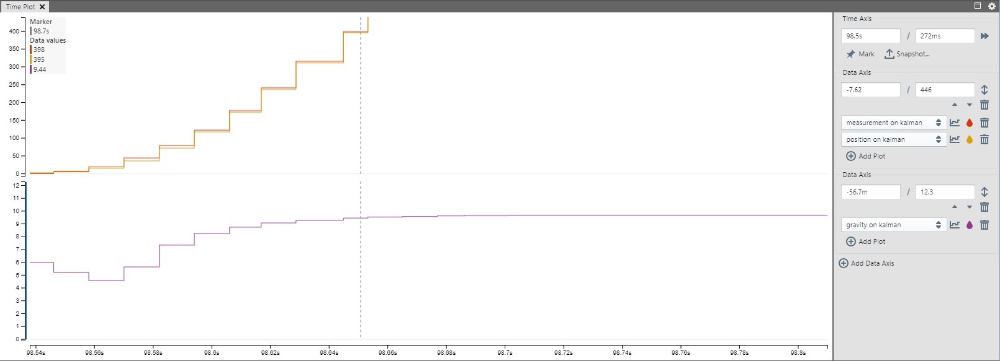

For this example, the measured position, estimated position and estimated gravity are illustrated.
The yellow is the true measurement, the red is the estimated position and the purple one is gravity. Every second one new measurement is taken, which gives feedback to guide the estimates of the position and gravity. Looking at gravity it starts with the initilization value of 6 m/s^2 and gradually improves the estimates towards the goal of 9.81 m/s^2 .

To Use the Data Visualizer, click Load Workspace → Choose data_visualizer.dvws and remember to change “SEND_OVER_USART” to true in peripherals/usart.h

## Standard Kalman Filter Equations
After initialization, the _prediction_ and _update_ phases happen when the algorithm runs. The _update_ phase updates the variables based on the error it had from the _prediction_.
Refer to the Microchip [Microchip Application Note AN4515: "Processing Analog Sensor Data with Digital Filtering"](https://ww1.microchip.com/downloads/en/Appnotes/ProcessAnalogSensorDataDigitalFiltering-DS00004515.pdf) for further details on the principle of the Kalman filter.

### Discrete Dynamic Equation

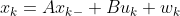 

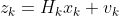 

Where 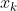  is the stat at time step 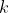, 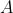 is the state-transition matrix, 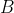 is the control-input model, 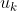 is the actuation at time step k and 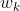 is the process noise which is a normal distribution with zero mean and a covariance given by 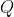 

### Prediction
Predicted state: 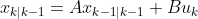 

Predicted covariance: 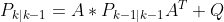 

Where 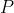  is the estimated covariance matrix. The first number in the subscript indicates the priori er prediction step, while that last number indicates the posteriori or update step. Meaning that 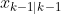 is the complete estimate from the time step 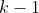, while 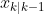 is the predicted estimate, but not corrected estimate for time step . 

### Update

<!-- image of this can be found at:
https://medium.com/@mithi/object-tracking-and-fusing-sensor-measurements-using-the-extended-kalman-filter-algorithm-part-1-f2158ef1e4f0

https://furrah.github.io/kalman-filter-rlc/
--->

Innovation: 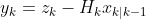 

Innovation covariance: 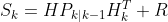 

Optimal Kalman Gain: 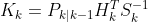 

Updated state estimate: 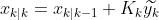 

Updated covariance: 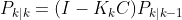 

Measurement of post-fit innovation: 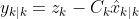 

### Limitations of library implementation

 1) In the kalman_predict_x the prediction only takes into account the last state and not the input
    2) In the kalman_predict_Q the update uses the formula  instead of  which is what is present in all literature. 
2) The kalman_predict_Q does not predict the  matrix, but the 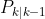 matrix and should therefore be renamed.  
