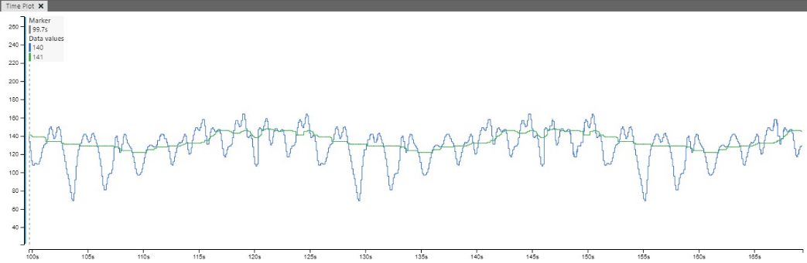

# Median filter

## Principle
The Median filter smooths a signal by removing spikes. The median filter can be used both on images and on 1-dimensional signal problems, which will be covered here. The median is calculated by sorting a list of numbers and finding the number in the middle.

The median filter has a window size, determining how far it will look back. For example, a window size of 9 will have eight elements looking back and one new element. The filter returns the median of these nine elements.

### Example: Finding the Median of an Array
Consider the array `[31, 15, 8, 91, 31, 90, 1, 5]`. After sorting, the element in the middle (here: The 5th position) is the median of the array:
```
[1,5,8,9,15,31,31,90,91]
         ^^
```
When conducting continuous measurements, the oldest element in the array is replaced with the new value, and after sorting, a new median can be determined.
The implementation we chose can be found at https://github.com/accabog/MedianFilter and was written by Alexandru Bogdan.

## Median filter - Visualization
A code block has been added that sends both the original signal and the filtered signal over USART0. This signal can be viewed using the Data Visualizer. Here visualization is done using window size 31.
```c
// sending data over usart
variableWrite_SendFrame(original, filtered);
```


The green is the filtered signal and the blue is the original signal. Using the MPLAB® Data Visualizer to compare the two signals sent over the Universal Synchronous and Asynchronous Receiver and Transmitter - USART, there is a clear difference between the two. The median filter removes the spikes in the signal, and it becomes the median of the current signal and the previous samples. In this case, the filtered signal results in a cleaner sine wave.

To Use the Data Visualizer, click Load Workspace → Choose data_visualizer.dvws.
Refer also to the [Microchip Application Note AN4515: "Processing Analog Sensor Data with Digital Filtering"](https://ww1.microchip.com/downloads/en/Appnotes/ProcessAnalogSensorDataDigitalFiltering-DS00004515.pdf).

## Performance and Properties
The median filter has a selectable window size. This window size affects both the ability to filter and how long it takes to process.
To measure the time/cycles on <b>PORT D</b> on <b>PIN 6</b>, connect the pin to a logic analyzer. By knowing the device speed, it is possible to time the filter.

| Filter Size   | Cycles                    |
|:-------------:| :-----------------------:|
| 7             | 215 - 385.8               |
| 15            | 225.8 - 601.8             |
| 31            | 344.8 - 1034              |

Because of the type of implementation, the number of cycles varies from sample to sample. The reason is the amount of sorting work when inserting a sample. It depends on how many updates the if-statement does and if the for-loop can exit early: If a number is smaller than one of the values in the array, the loop is exited. In the worst case, it needs to iterate through the entire list of values, which is the window size.

The value of the `i` is later used for adjusting the median when needed. The algorithm does not account for the extraordinary situation with even numbers where the median would be the average of two numbers.
```c
for(i = 0; i < medianFilter->numNodes - 1; i++)
{
    if(sample < it->value)
    {
        if(i == 0)
        { //replace value head if new node is the smallest
            medianFilter->valueHead = newNode;
        }
        break;
    }
    it = it->nextValue;
}
```
## Conclusion and Use Cases
We have shown briefly how a median filter works and how to use it. We also demonstrated how to measure the cycle times for your application using an oscilloscope or logic analyzer.

A median filter is a nice method for removing noise or peaks from the signal and can often be used as a preprocessing step in front of more advanced filters, like a Kalman filter. The difference between a Median filter and more advanced filters is that a Median filter does not fold the extreme values into the signal like in an average filter and therefore removes their impact on the signal.

## Sources
-  https://github.com/accabog/MedianFilter